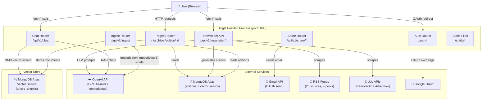

# ⚡ AI Pulse Newsletter

> An AI-powered weekly newsletter platform that automatically curates the latest AI industry news, tools, and career opportunities — with an integrated RAG chatbot for conversational Q&A over all archived editions.

[](https://www.python.org/)
[](https://fastapi.tiangolo.com/)
[](https://www.mongodb.com/atlas)
[](https://platform.openai.com/)
[](https://www.langchain.com/)

---

## 🌐 Live Demo

> 🔗 **Live Demo:** [https://ai-newsletter-ka28.onrender.com](https://ai-newsletter-ka28.onrender.com)

---

## 📖 About the Project

**AI Pulse Newsletter** is a full-stack, production-ready platform for generating, publishing, and interacting with AI-curated newsletters. It solves the problem of information overload in the fast-moving AI industry by automatically:

1. **Scraping** the latest AI news from 20 section-specific RSS feeds (TechCrunch, WIRED, The Decoder, Anthropic, Hugging Face, IEEE Spectrum, etc.) and live AI/ML job listings from RemoteOK and Arbeitnow.
2. **Curating** that raw content through OpenAI's GPT models into five structured newsletter sections, with cross-edition URL deduplication to ensure every article is unique.
3. **Enriching** each selected article by scraping its full text at generation time (trafilatura + BeautifulSoup), storing rich content directly in MongoDB for the RAG pipeline.
4. **Publishing** each edition to a responsive web UI with light, dark, and warm themes, a full archive with search, and shareable individual edition pages.
5. **Delivering** newsletters directly to a reader's own Gmail inbox (via the Gmail API) after they log in with Google OAuth.
6. **Answering questions** about any published edition through an embedded RAG chatbot, powered by LangChain, MongoDB Atlas Vector Search with MMR retrieval, and OpenAI.

**Who it is for:** AI professionals, researchers, product teams, and anyone who wants a curated, structured weekly digest of what is happening in AI — without manually sifting through dozens of sources.

---

## ✨ Features

### Newsletter Platform
- **AI-powered content generation** — scrapes real articles from 20 section-specific RSS feeds and generates 5 curated sections using OpenAI GPT
- **Section-specific feed pools** — each newsletter section (Trending Topics, Top Developments, Corporate Tools, Future Trends) draws from its own dedicated set of RSS feeds, eliminating cross-section article duplication
- **Cross-edition deduplication** — previously used article URLs are automatically excluded from future editions
- **Full-text scraping at generation time** — article full text is scraped and stored in MongoDB when editions are created, not at RAG ingestion time
- **Real job listings** — fetches AI/ML roles from RemoteOK and Arbeitnow with keyword-based relevance filtering
- **Five newsletter sections** — Trending Topics, Top Developments, Corporate AI Tools, Future Requirements & Trends, AI Jobs Board
- **AI-generated section previews** — each section includes a one-sentence description shown in collapsed state
- **Expandable sections** — all sections collapse by default with smooth animations; click to expand
- **Full archive with search** — search across all editions by keyword, year, and month
- **Three UI themes** — Light ☀️, Dark 🌙, and Warm 🍂, with `localStorage` persistence and no flash on load
- **Edition sharing** — logged-in users can email any edition to themselves via their Gmail account
- **Google OAuth login** — signed cookie sessions using `itsdangerous`
- **Responsive design** — mobile-first layout served as Jinja2 templates

### RAG Chatbot
- **Conversational Q&A** — ask any question about newsletter content; the chatbot answers with citations from published editions
- **Whole-article embedding** — articles are embedded as complete documents (not small chunks), with contextual headers baked into each document for better semantic matching
- **MMR retrieval** — Maximal Marginal Relevance ensures diverse results across different sources and topics, not 5 chunks of the same article
- **Floating chat widget** — bottom-right icon embedded on every page, no page reload required
- **Source citations** — every answer references edition numbers and source names
- **Off-topic handling** — declines non-AI questions; for mixed queries, answers only the AI-relevant part
- **Conversation memory** — sliding window of the last 5 turns, TTL-based session expiry
- **Cost-optimized** — uses `text-embedding-3-small` (5x cheaper than ada-002) with minimal metadata (only `edition_number`)

---

## 🏗️ Architecture

### High-Level Diagram



### Layer Descriptions

| Layer | Details |
|---|---|
| **Frontend** | Jinja2 HTML templates served by FastAPI. Vanilla JS + CSS (no build step). Three themes via CSS custom properties. |
| **Backend** | FastAPI + Uvicorn. Handles page rendering, newsletter CRUD, Google OAuth, Gmail share, and the RAG chat endpoints. |
| **Chatbot module** | LangChain pipeline: MongoDB Atlas Vector Search (MMR retriever, k=5, fetch_k=20) → `ChatOpenAI` (gpt-4o-mini, temp 0.3) → `StrOutputParser`. Ingestion reads full article text from MongoDB editions and embeds whole articles with contextual headers via `text-embedding-3-small`. |
| **Database** | MongoDB Atlas (async `pymongo`). `editions` collection for newsletter content + `article_chunks` collection for vector search with 1536-dimension embeddings. |
| **LLM** | OpenAI API — `gpt-4o-mini` for generation and chat answers, `text-embedding-3-small` for embeddings ($0.02/1M tokens). |
| **Email** | Gmail API. Emails are sent using the logged-in user's own Google OAuth `access_token` (scope: `gmail.send`). |
| **Vector store** | MongoDB Atlas Vector Search. Collection: `article_chunks`. Each document contains a contextual header + full article text, with only `edition_number` as metadata. MMR retrieval ensures diverse results. |
| **News sources** | 20 RSS feeds organized into 4 section-specific pools: Trending Topics (TechCrunch, The Verge, WIRED, The Decoder, ZDNet), Top Developments (Anthropic, Google AI Blog, Hugging Face, Cohere, Mistral, Claude Blog), Corporate Tools (The New Stack, MarkTechPost, Ars Technica), Future Requirements (IEEE Spectrum, AISI, The Batch, TLDR AI, Anthropic Research, Ai2). |
| **Job sources** | REST APIs: RemoteOK, Arbeitnow. Filtered by AI/ML keywords. |

---

## 🛠️ Tech Stack

| Category | Technology | Version |
|---|---|---|
| **Backend framework** | FastAPI | 0.128.x |
| **ASGI server** | Uvicorn | 0.39.x |
| **Database** | MongoDB Atlas (pymongo async) | 4.16.x |
| **Configuration** | Pydantic Settings | 2.11.x |
| **HTTP client** | httpx | 0.28.x |
| **RSS parsing** | feedparser | 6.0.x |
| **Templating** | Jinja2 | 3.1.x |
| **LLM provider** | OpenAI API | — |
| **RAG framework** | LangChain + LangChain-OpenAI + LangChain-MongoDB | ≥0.3.0 |
| **Vector store** | MongoDB Atlas Vector Search (langchain-mongodb) | ≥0.3.0 |
| **Embedding model** | OpenAI text-embedding-3-small (1536 dims) | — |
| **Article scraping** | trafilatura + BeautifulSoup4 | ≥1.6.0 / ≥4.12.0 |
| **Session signing** | itsdangerous | 2.2.x |
| **Retry logic** | tenacity | ≥8.2.0 |
| **SSL (MongoDB)** | certifi | 2026.x |
| **Frontend** | Vanilla HTML/CSS/JS | — |
| **Auth** | Google OAuth 2.0 | — |
| **Email delivery** | Gmail API | — |
| **Deployment** | Render | — |

---

## 📁 Project Structure

```
AI-Newsletter/
├── backend/                        # Main FastAPI application
│   ├── main.py                     # App entry point; mounts all routers + static files
│   ├── config/
│   │   ├── settings.py             # Pydantic Settings — loads all env vars
│   │   └── templates.py            # Jinja2 template environment config
│   ├── database/
│   │   └── connection.py           # Async MongoDB client + FastAPI lifespan
│   ├── models/
│   │   ├── newsletter.py           # NewsletterEdition, NewsletterSection, ContentItem models
│   │   ├── job.py                  # JobListing model
│   │   └── share.py                # SendToSelfRequest / ShareEmailResponse
│   ├── routers/
│   │   ├── health.py               # GET /api/v1/health
│   │   ├── auth.py                 # Google OAuth (/auth/login, /callback, /logout, /me)
│   │   ├── newsletter.py           # Newsletter CRUD API (/api/v1/newsletter/*)
│   │   ├── share.py                # Email-to-self (/api/v1/share/send-to-self)
│   │   └── pages.py                # Jinja2 HTML page routes (/, /archive, /edition/:id)
│   └── services/
│       ├── content_generator.py    # Orchestrates section-by-section LLM generation + full-text scraping + cross-edition dedup
│       ├── llm_client.py           # OpenAI API client with structured JSON output
│       ├── news_scraper.py         # Section-specific RSS feed pools (20 feeds across 4 pools)
│       ├── jobs_scraper.py         # AI job listings scraper (RemoteOK + Arbeitnow)
│       ├── jobs_service.py         # Formats jobs into newsletter section
│       ├── newsletter_service.py   # MongoDB CRUD for editions (create, get, archive, search)
│       ├── email_service.py        # Gmail API email builder + sender
│       └── rate_limiter.py         # In-memory rate limiter for share endpoint
│
├── chatbot/                        # RAG chatbot module (runs as separate service on port 8001)
│   ├── main.py                     # Standalone chatbot FastAPI entry point
│   ├── config/
│   │   └── settings.py             # Chatbot settings (embedding model, max doc chars, vector index)
│   ├── ingestion/
│   │   ├── ingest.py               # Pipeline: MongoDB editions → create documents → embed in Atlas Vector Search
│   │   ├── chunker.py              # Whole-article document creation with contextual headers (7000-char split threshold)
│   │   ├── embedder.py             # MongoDB Atlas Vector Search store + OpenAI text-embedding-3-small
│   │   └── article_scraper.py      # Article scraping utilities (trafilatura + BeautifulSoup)
│   ├── retrieval/
│   │   ├── chain.py                # LangChain chain: MMR retriever → ChatOpenAI → StrOutputParser
│   │   └── vector_store.py         # MMR retriever (k=5, fetch_k=20, lambda=0.7)
│   ├── models/
│   │   └── schemas.py              # ChatRequest, ChatResponse, SourceReference (edition_number only)
│   ├── routers/
│   │   └── chat.py                 # POST /api/v1/chat, POST /api/v1/ingest
│   └── services/
│       └── chat_service.py         # Chat orchestration and session management
│
├── frontend/                       # Jinja2 templates + static assets
│   ├── templates/
│   │   ├── base.html               # Base layout (header, footer, chat widget, CSS/JS)
│   │   ├── index.html              # Homepage — latest edition view
│   │   ├── archive.html            # Archive listing with search and month filters
│   │   ├── edition.html            # Individual edition full-page view
│   │   ├── empty.html              # Empty state (no editions yet)
│   │   └── partials/
│   │       ├── header.html         # Site header (nav, theme toggle, Google login)
│   │       ├── footer.html         # Site footer
│   │       ├── chat_widget.html    # Floating chat panel HTML
│   │       ├── section_trending.html
│   │       ├── section_developments.html
│   │       ├── section_tools.html
│   │       ├── section_future.html
│   │       ├── section_jobs.html
│   │       └── share_button.html
│   └── static/
│       ├── css/
│       │   ├── reset.css           # CSS reset
│       │   ├── typography.css      # Fonts and text styles
│       │   ├── layout.css          # Page structure and grid
│       │   ├── sections.css        # Newsletter section cards
│       │   ├── auth.css            # Login button and profile dropdown
│       │   ├── chat.css            # Chat widget styles
│       │   └── responsive.css      # Breakpoints and mobile layout
│       └── js/
│           ├── theme.js            # Three-theme toggle with localStorage
│           ├── auth.js             # Google login state, profile dropdown
│           ├── chat.js             # Chat widget client (fetch → /api/v1/chat)
│           ├── sections.js         # Expand/collapse section animations
│           ├── share.js            # Send-to-self email flow
│           ├── archive.js          # Archive search and filter logic
│           └── smooth-scroll.js    # Smooth anchor scrolling
│
├── requirements.txt                # All Python dependencies
├── .env.example                    # Environment variable template
├── .gitignore
└── AI_Newsletter_Documentation.pdf # Project documentation
```

---

## 🚀 Getting Started

For the complete step-by-step setup, see **[SETUP_GUIDE.md](SETUP_GUIDE.md)**.

### Quickstart

```bash
# 1. Clone the repository
git clone https://github.com/tanmayiitj/AI-Newsletter.git
cd AI-Newsletter

# 2. Create and activate a virtual environment
python -m venv .venv
source .venv/bin/activate        # macOS/Linux
# .venv\Scripts\activate         # Windows

# 3. Install dependencies
pip install -r requirements.txt

# 4. Configure environment variables
cp .env.example .env
# Edit .env with your MongoDB URI, OpenAI API key, and other credentials

# 5. Start the backend (serves frontend + API + chatbot on one port)
uvicorn backend.main:app --host 0.0.0.0 --port 8000

# 6. Open the app
# http://localhost:8000
```

---

## 🔑 Environment Variables

Copy `.env.example` to `.env` and fill in every value before running.

| Variable | Description | Required | Where to get it |
|---|---|---|---|
| `MONGODB_URI` | Full MongoDB connection string | ✅ Yes | MongoDB Atlas → Connect → Drivers |
| `MONGODB_DB_NAME` | Database name (default: `ai_pulse`) | No | Any name you choose |
| `OPENAI_API_KEY` | OpenAI secret key | ✅ Yes | [platform.openai.com/api-keys](https://platform.openai.com/api-keys) |
| `OPENAI_MODEL` | Model to use (default: `gpt-4o-mini`) | No | Any chat model name |
| `ADMIN_API_KEY` | Secret key for protected admin endpoints | ✅ Yes | Generate: `python -c "import secrets; print(secrets.token_urlsafe(32))"` |
| `APP_ENV` | `development` or `production` | No | Set manually |
| `APP_PORT` | Server port (default: `8000`) | No | Set manually |
| `GOOGLE_CLIENT_ID` | Google OAuth 2.0 client ID | ✅ For auth/email | [console.cloud.google.com](https://console.cloud.google.com/apis/credentials) |
| `GOOGLE_CLIENT_SECRET` | Google OAuth 2.0 client secret | ✅ For auth/email | Same as above |
| `GOOGLE_REDIRECT_URI` | OAuth callback URL | No | Set to `http://localhost:8000/auth/callback` for local dev |
| `SESSION_SECRET_KEY` | Key for signing session cookies | ✅ Yes | Generate: `python -c "import secrets; print(secrets.token_urlsafe(32))"` |
| `SESSION_MAX_AGE` | Session lifetime in seconds (default: `86400` = 24 h) | No | Set manually |
| `RATE_LIMIT_MAX_REQUESTS` | Max share emails per user per window (default: `3`) | No | Set manually |
| `RATE_LIMIT_WINDOW_SECONDS` | Rate-limit window in seconds (default: `600`) | No | Set manually |

> **Note:** `GOOGLE_CLIENT_ID` / `GOOGLE_CLIENT_SECRET` are only required if you want Google login and the email-to-self feature. The newsletter generation and chatbot work without them.

---

## 📡 API Endpoints

All endpoints are served from the single backend process (default port **8000**).

### Pages (HTML)

| Method | Endpoint | Description |
|---|---|---|
| `GET` | `/` | Homepage — latest newsletter edition |
| `GET` | `/archive` | Archive page with search and month filter |
| `GET` | `/edition/{edition_id}` | Full view of a single edition |

### Newsletter

| Method | Endpoint | Auth | Description |
|---|---|---|---|
| `POST` | `/api/v1/newsletter/generate` | `X-API-Key` header | Trigger AI generation of a new edition |
| `GET` | `/api/v1/newsletter/latest` | — | Latest published edition (JSON) |
| `GET` | `/api/v1/newsletter/archive` | — | Paginated edition list (`?page=1&per_page=10`) |
| `GET` | `/api/v1/newsletter/search` | — | Search editions (`?q=&year=&month=&limit=10`) |
| `GET` | `/api/v1/newsletter/months` | — | Available publication years |
| `GET` | `/api/v1/newsletter/{edition_id}` | — | Specific edition by MongoDB ID (JSON) |

### Authentication

| Method | Endpoint | Description |
|---|---|---|
| `GET` | `/auth/login` | Redirect to Google OAuth consent screen |
| `GET` | `/auth/callback` | Handle OAuth callback; set session cookie |
| `POST` | `/auth/logout` | Clear session cookie |
| `GET` | `/auth/me` | Return current user profile (401 if not logged in) |

### Share

| Method | Endpoint | Auth | Description |
|---|---|---|---|
| `POST` | `/api/v1/share/send-to-self` | Session cookie | Send the edition to your own Gmail inbox |

### Chatbot

| Method | Endpoint | Auth | Description |
|---|---|---|---|
| `POST` | `/api/v1/chat` | — | Send a message; returns RAG-powered answer + source citations |
| `POST` | `/api/v1/ingest` | `X-API-Key` header | Ingest newsletters into MongoDB Atlas Vector Search (`?full_reindex=false`) |

### Health

| Method | Endpoint | Description |
|---|---|---|
| `GET` | `/api/v1/health` | Returns `healthy` + MongoDB connectivity status |

---

## 🤖 Chatbot Module

The RAG chatbot runs as a separate FastAPI service on port 8001. It is accessible via the floating chat icon on every page, or programmatically via the API.

### How it works

1. **Content Generation** — When a new edition is generated, the system scrapes full article text from each selected article's URL (using trafilatura + BeautifulSoup) and stores it in the `full_text` field on each ContentItem in MongoDB. Articles are sourced from 20 RSS feeds organized into 4 section-specific pools, with cross-edition URL deduplication ensuring every article is unique.
2. **Ingestion** — The ingestion pipeline reads published editions from MongoDB. For each article, it takes the stored `full_text` (or falls back to the `summary`), prepends a contextual header (article title, source name, edition number), and embeds the complete document using `text-embedding-3-small` (1536 dimensions) into MongoDB Atlas Vector Search. Each document carries only `edition_number` as metadata. Articles under 7000 chars become a single document; longer articles are split at exact 7000-char boundaries.
3. **Retrieval** — When a user asks a question, the system uses MMR (Maximal Marginal Relevance) retrieval (k=5, fetch_k=20, lambda=0.7) to find the 5 most relevant *and diverse* documents. MMR prevents returning 5 near-duplicate results about the same news story.
4. **Answer** — A LangChain chain passes the retrieved context, chat history (last 5 turns), and the question to `gpt-4o-mini`, which replies with cited references to edition numbers and source names. Off-topic questions are politely declined; mixed queries get only the AI-relevant part answered.

### Key Design Decisions

| Decision | Rationale |
|---|---|
| Whole-article embedding (no chunking for articles <7K chars) | Eliminates redundant chunks competing for top-k slots; each article = 1 document |
| Contextual headers baked into page_content | Article title, source, and edition are part of the embedding — enables queries like "what did TechCrunch report?" |
| Only `edition_number` as metadata | 14 fields → 1. All context needed by the LLM is in the text itself |
| MMR instead of hybrid search | Ensures diverse results without requiring a separate full-text search index |
| Full-text scraping at generation time | Articles are scraped once when the edition is created, not at RAG ingestion time — eliminates scraping fragility |
| Section-specific RSS feed pools | Each section draws from its own feeds — no article appears in multiple sections |

### Chat API

**Request:**
```json
{
  "message": "What AI tools were mentioned in the latest edition?",
  "session_id": "optional-uuid-for-conversation-continuity"
}
```

**Response:**
```json
{
  "answer": "Based on Edition #12, the corporate AI tools section highlighted...",
  "sources": [
    {
      "edition_number": 12
    }
  ],
  "session_id": "uuid"
}
```

### Admin ingestion

```bash
# Incremental (only new editions, skips already-ingested)
curl -X POST http://localhost:8001/api/v1/ingest \
  -H "X-API-Key: YOUR_ADMIN_API_KEY"

# Full re-index (drops collection, recreates vector index, re-embeds editions 7+)
curl -X POST "http://localhost:8001/api/v1/ingest?full_reindex=true" \
  -H "X-API-Key: YOUR_ADMIN_API_KEY"
```

---

## 🖼️ Screenshots

> Add screenshots of the UI here — homepage, archive page, chat widget open, dark theme, email share dialog.

---

## 🗺️ Roadmap

- [x] Section-specific RSS feed pools (20 feeds across 4 pools)
- [x] Cross-edition URL deduplication
- [x] Full-text article scraping at generation time
- [x] MongoDB Atlas Vector Search (replaced ChromaDB)
- [x] Whole-article embedding with contextual headers
- [x] MMR retrieval for diverse results
- [x] text-embedding-3-small (5x cheaper than ada-002)
- [ ] Scheduled automatic newsletter generation (cron / GitHub Actions)
- [ ] Backfill full_text for existing editions 7-21 via batch scraping
- [ ] Email subscription list with opt-in/opt-out management
- [ ] Multiple LLM provider support (Gemini, Claude, local models)
- [ ] Webhook or push notifications when a new edition is published
- [ ] Admin dashboard for managing editions and monitoring generation status
- [ ] RSS/Atom feed output for the newsletter archive

---

## 🤝 Contributing

1. Fork the repository
2. Create a feature branch: `git checkout -b feature/your-feature-name`
3. Commit your changes: `git commit -m "feat: add your feature"`
4. Push to the branch: `git push origin feature/your-feature-name`
5. Open a Pull Request targeting the `001-ai-pulse-newsletter` branch

Please keep PRs focused and include a clear description of what changed and why.

---

## 📄 License

This project is currently unlicensed. Consider adding an [MIT](https://opensource.org/licenses/MIT) or [Apache-2.0](https://opensource.org/licenses/Apache-2.0) license.

---

## 👤 Author

**Tanmay** — GitHub: <a href="https://github.com/tanmayiitj">@tanmayiitj</a>

---

## 🙏 Acknowledgements

- [FastAPI](https://fastapi.tiangolo.com/) — high-performance Python web framework
- [OpenAI](https://openai.com/) — LLM API powering content generation and chatbot answers
- [LangChain](https://www.langchain.com/) — RAG framework and LCEL chain composition
- [MongoDB Atlas Vector Search](https://www.mongodb.com/products/platform/atlas-vector-search) — cloud-native vector search with MMR retrieval\n- [trafilatura](https://trafilatura.readthedocs.io/) — web article text extraction
- [MongoDB Atlas](https://www.mongodb.com/atlas) — managed cloud database
- [Pydantic](https://docs.pydantic.dev/) — data validation and settings management
- [feedparser](https://feedparser.readthedocs.io/) — RSS feed parsing
- [itsdangerous](https://itsdangerous.palletsprojects.com/) — secure session signing
- [RemoteOK](https://remoteok.com/) and [Arbeitnow](https://www.arbeitnow.com/) — job listing APIs
